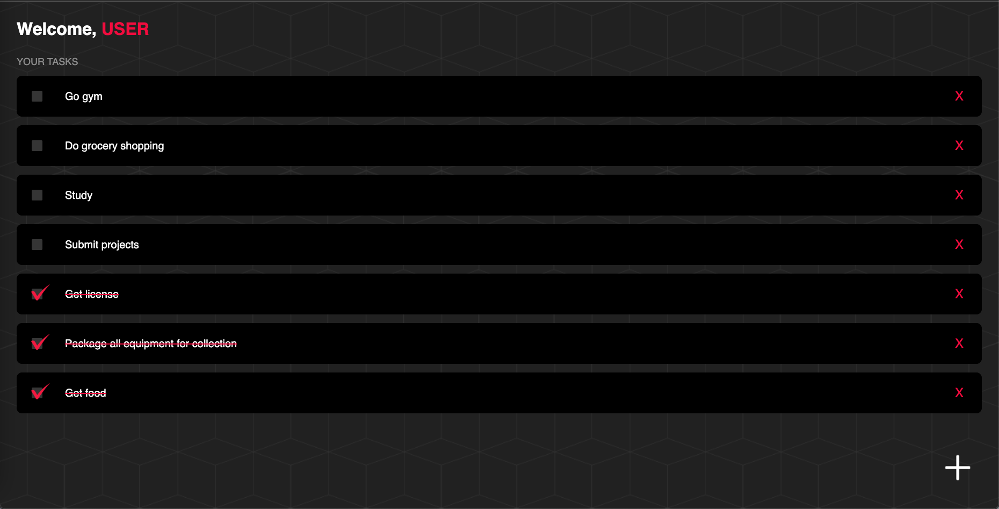
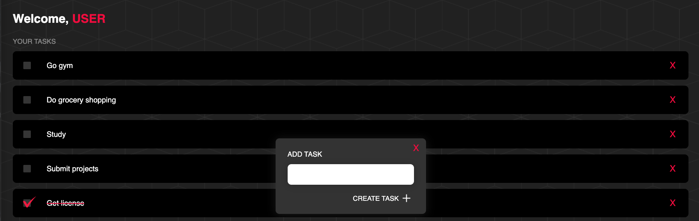

# react-TodoList-app
Small fullstack React app that allows user to create/check/delete tasks.
The entire frontend was created using ReactJS. The backend was created using NodeJS with a MongoDB database.

